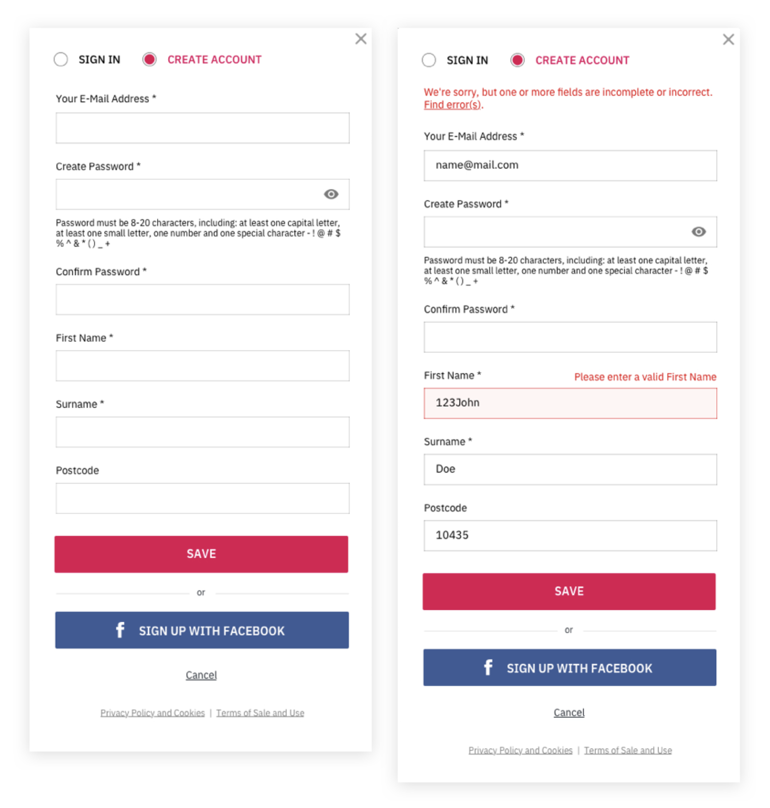
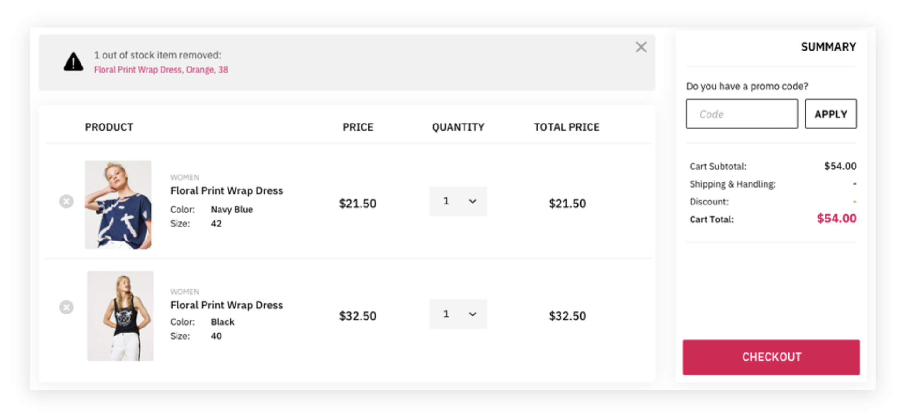
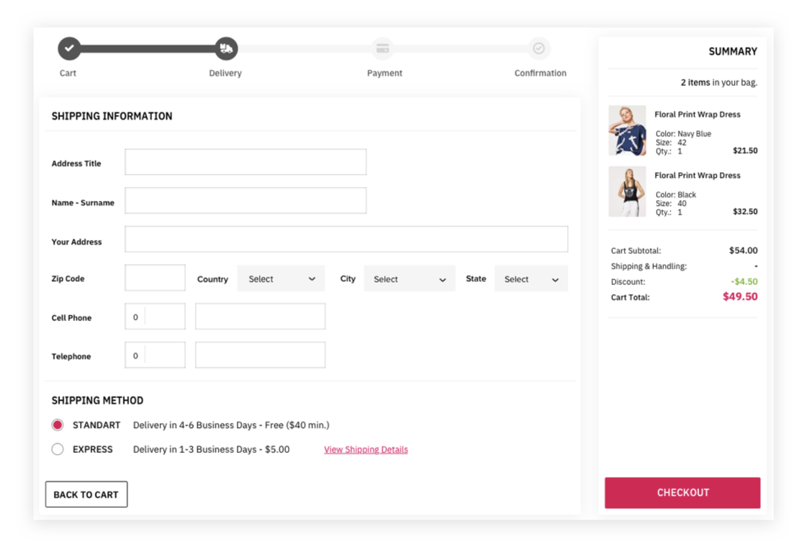
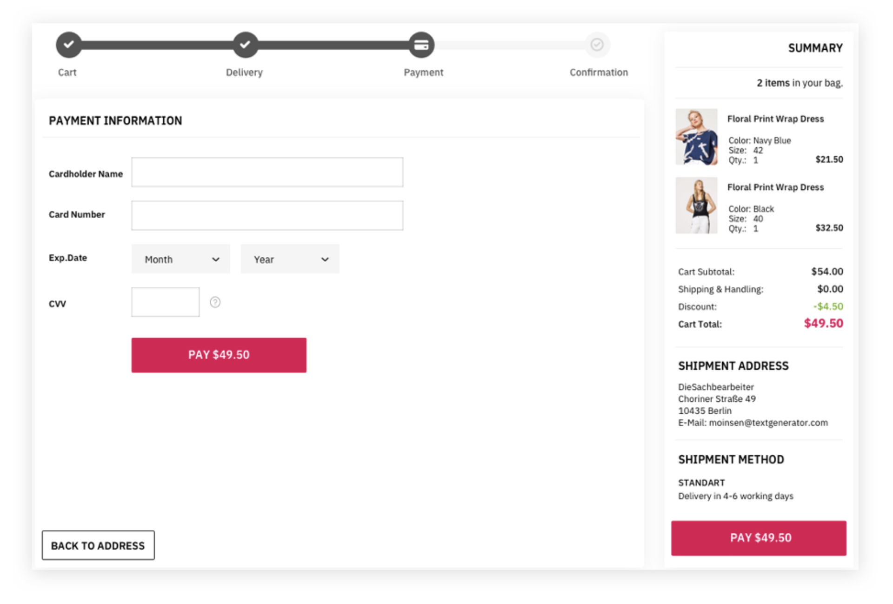
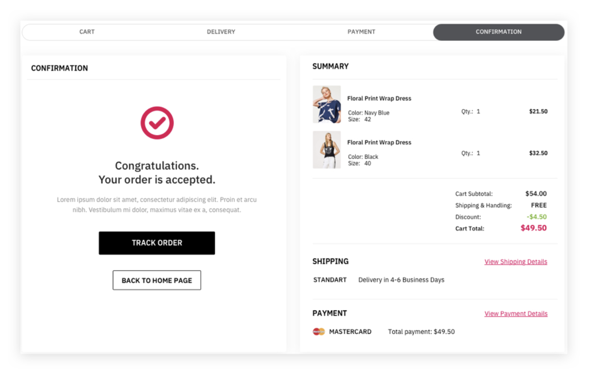

# Code Commerce
Developer: Vincent Andre Washington

[Github](https://github.com/VWashingtonCoder)
[LinkedIn](https://www.linkedin.com/in/vincent-washington/)

## Project Overview
You are going to build an e-commerce store for code. A super-smart person decided it was time for developers to actually make money with code instead of posting it for free online. Introducing Code Commerce -- a store where developers can sell pre-built code projects and snippets.

🔍 This project focuses on a few major principles:
    - Forms and form validation with React
    - Building stateful components
    - Passing data between components

## 🛠 Requirements:
You will build a 5-part checkout form. 
    1) Signup/Login
    2) Customer cart
    3) Shipping information 
    4) Payment information
    5) Confirmation

Must include the "progress bar" as shown in the SHIPPING & PAYMENT mockup below.

Note: Please do NOT use React Routing in this project. You will learn about it later. The goal is to master components, props, state and conditional UI rendering.

### 🛠 Signup/Login
1) User can sign-in
2) Password field is obscured
3) There is an "eye" icon next to password to reveal what is being typed
4) If password is invalid, show an error message as depicted in the screenshot below
5) If successful sign-in, take user to Customer Cart
6) User can switch between Sign in and Create Account
7) If creating an account there will be two password fields
8) Passwords must match or show appropriate error as depicted below
9) First name and last name cannot have numbers
10) Postal code must not allow text (numbers only)
11) Show an "eye" icon next to password to reveal what is being typed
12) If an account for that email already exists, show an error message
13) Add a facebook sign in button (non-functional)

### 🛠 Customer Cart
1) Create a cart that has 2-5 items in it
2) These should be actual components with item value
3) The total sum of all items should be calculated as a total
4) Items can be removed and quantities can be increased or decreased -- cart total should adjust accordingly
5) If there are zero cart items the Checkout button should be disabled
6) If Checkout is selected move to the shipping screen

### 🛠 Shipping Information
1) Show all shipping fields as depicted in the screenshot below
2) Have standard and express shipping options -- the shipping & handling/checkout prices should adjust accordingly
3) Ensure phone fields cannot take text (only numbers)
4) Ensure postal code cannot take text (only numbers)
5) Make sure all fields are completed or prevent the user from moving forward. Show appropriate error messages
6) Back to cart button should go back to cart
7) There should be a Next or "Payment" button to go to next screen

### 🛠 Payment Information
1) Create a credit card formatted that takes all major credit cards (Visa, Master Card, American Express, etc)
2) Format the credit card field so the numbers are properly spaced (we don't want it to look ugly!)
3) Have a dropdown for month and year for expiration dates
4) Show errors if fields are entered incorrectly
5) The Pay button should show the total price. If the fields are not complete this button should be disabled
6) Make sure to show the cart/total at the right (or somewhere else)
7) The Pay button should take the user to the confirmation screen
8) A user should be able to apply a promo code and receive a discount.

### 🛠 Confirmation Screen
1) Should show amount paid
2) Should show last 4 digits of credit card used to make the purchase
3) Add other UI as depicted below

## Resources
[Conditional rendering in React](https://jason-brewer.medium.com/conditional-rendering-react-1108159cf998?source=friends_link&sk=d3674b5675a8e3c15ad3035a32a6da12)